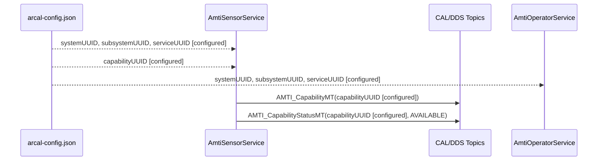
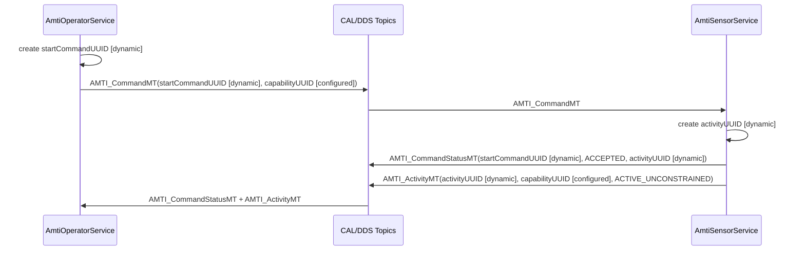
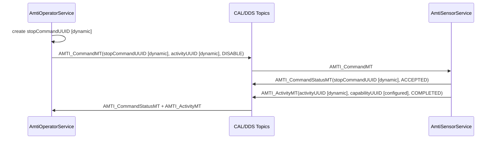

# AMTI Service Demo

This sample demonstrates the CAL message choreography for a small AMTI service
using the raw generated CxxCAL API. It intentionally keeps `T::create(asb)`,
`T::destroy(accessor)`, concrete listener classes, and explicit reader/writer
cleanup visible. It also shows the direct ASBC lifecycle:
`uci_getAbstractServiceBusConnection(...)`, `shutdown()`, and
`uci_destroyAbstractServiceBusConnection(...)`.

It is documentation-grade: the AMTI payloads are intentionally skeletal, while
the identity, UUID, topic, command, status, and activity flow are explicit.

For the same style of flow using ARCAL's optional C++ helper layer, compare this
sample with `examples/smti_service_demo`.

The sample uses configured CAL identity. Do not run it with `ARCAL_CONFIG=NONE`.

## Build

```bash
cmake -S . -B build \
  -DARCAL_BUILD_EXAMPLES=ON \
  -DCMAKE_PREFIX_PATH="$HOME/.local" \
  -G Ninja

cmake --build build --target arcal_amti_service_demo -j4
```

## Run

In both terminals:

```bash
export ARCAL_CONFIG="$PWD/examples/amti_service_demo/arcal-config.json"
export CYCLONEDDS_URI="file://$PWD/test/e2e/cyclonedds_localhost.xml"
```

Terminal 1:

```bash
./build/examples/amti_service_demo/arcal_amti_service_demo service
```

Terminal 2:

```bash
./build/examples/amti_service_demo/arcal_amti_service_demo client --demo
```

The service exits after it accepts a start command, publishes an active
activity, accepts a stop command for that activity, and publishes the completed
activity update.

## UUID Lifecycle

| UUID | Source | Owner | Carried by |
|------|--------|-------|------------|
| `systemUUID` | configured | CAL config | ASBC identity |
| `subsystemUUID` | configured | CAL config | ASBC identity, `AMTI_ActivityMT` subsystem ID |
| `AmtiSensorService` UUID | configured | CAL config | service ASBC identity |
| `AmtiOperatorService` UUID | configured | CAL config | client ASBC identity |
| `capabilityUUID` | configured | CAL config | `AMTI_CapabilityMT`, `AMTI_CapabilityStatusMT`, start `AMTI_CommandMT`, `AMTI_ActivityMT` |
| `startCommandUUID` | dynamic | client | start `AMTI_CommandMT`, matching `AMTI_CommandStatusMT` |
| `activityUUID` | dynamic | service | start `AMTI_CommandStatusMT`, `AMTI_ActivityMT`, stop `AMTI_CommandMT` |
| `stopCommandUUID` | dynamic | client | stop `AMTI_CommandMT`, matching `AMTI_CommandStatusMT` |

## Startup And Capability Advertisement



## Start Command Flow



## Stop Command Flow



## Notes

- The AMTI mission/radar details are intentionally sparse. This sample teaches
  CAL message flow and identity handling, not operational AMTI modeling.
- DDS discovery can take a moment on process startup. Start the service first,
  then run the client.
- The sample is not registered with CTest. It is built only when
  `ARCAL_BUILD_EXAMPLES=ON`.
