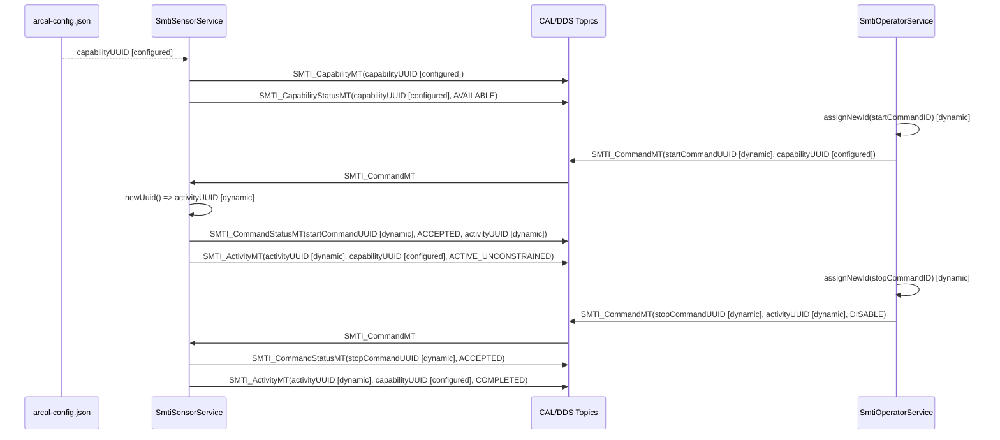

# SMTI Service Demo

This sample mirrors the AMTI service demo but uses ARCAL's optional
`uci::utils` helpers. It is the ergonomic C++ version of the same CAL pattern:
configured capability identity, dynamic command UUIDs, dynamic activity UUIDs,
command status, and activity publication.

The helpers are not part of the CxxCAL specification. They wrap the public
generated APIs and keep the underlying lifecycle visible in their names:
`makeMessage<T>()`, `MessagePtr<T>`, `ReaderPtr<T>`, `WriterPtr<T>`, and
`FunctionListener<T>`.

## Build

```bash
cmake -S . -B build \
  -DARCAL_BUILD_EXAMPLES=ON \
  -DCMAKE_PREFIX_PATH="$HOME/.local" \
  -G Ninja

cmake --build build --target arcal_smti_service_demo -j4
```

## Run

In both terminals:

```bash
export ARCAL_CONFIG="$PWD/examples/smti_service_demo/arcal-config.json"
export CYCLONEDDS_URI="file://$PWD/test/e2e/cyclonedds_localhost.xml"
```

Terminal 1:

```bash
./build/examples/smti_service_demo/arcal_smti_service_demo service
```

Terminal 2:

```bash
./build/examples/smti_service_demo/arcal_smti_service_demo client --demo
```

## Utility Comparison

Raw CxxCAL lifecycle:

```cpp
auto& message = uci::type::SMTI_CommandMT::create(asb);
// populate message
writer.write(message);
uci::type::SMTI_CommandMT::destroy(message);
```

Utility lifecycle:

```cpp
auto message = uci::utils::makeMessage<uci::type::SMTI_CommandMT>(asb);
// populate *message
writer->write(*message);
```

Raw listener class:

```cpp
class ActivityListener final : public uci::type::SMTI_ActivityMT::Listener {
public:
    void handleMessage(const uci::type::SMTI_ActivityMT& message) override;
};
```

Utility listener:

```cpp
uci::utils::FunctionListener<uci::type::SMTI_ActivityMT> listener(
    [](const uci::type::SMTI_ActivityMT& message) {
        // handle message
    });
```

## UUID Lifecycle

| UUID | Source | Owner | Carried by |
|------|--------|-------|------------|
| `systemUUID` | configured | CAL config | ASBC identity |
| `subsystemUUID` | configured | CAL config | ASBC identity, `SMTI_ActivityMT` subsystem ID |
| `SmtiSensorService` UUID | configured | CAL config | service ASBC identity |
| `SmtiOperatorService` UUID | configured | CAL config | client ASBC identity |
| `capabilityUUID` | configured | CAL config | `SMTI_CapabilityMT`, `SMTI_CapabilityStatusMT`, start `SMTI_CommandMT`, `SMTI_ActivityMT` |
| `startCommandUUID` | dynamic | client via `assignNewId()` | start `SMTI_CommandMT`, matching `SMTI_CommandStatusMT` |
| `activityUUID` | dynamic | service via `newUuid()` | start `SMTI_CommandStatusMT`, `SMTI_ActivityMT`, stop `SMTI_CommandMT` |
| `stopCommandUUID` | dynamic | client via `assignNewId()` | stop `SMTI_CommandMT`, matching `SMTI_CommandStatusMT` |

## Message Flow



## Notes

- Compare this sample with `examples/amti_service_demo` to see the raw CxxCAL
  lifecycle side by side with the utility wrappers.
- The SMTI mission/radar details are intentionally sparse. This sample teaches
  C++ ergonomics, CAL message flow, and identity handling.
